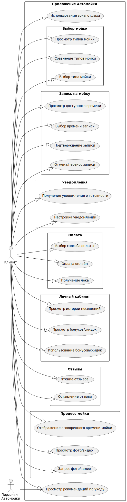

# car-wash
# Блок USER STORY
1. Выбор типа мойки:

•  Как клиент автомойки, я хочу иметь возможность выбрать тип мойки (ручную, автоматическую или экспресс), чтобы обслуживать мой автомобиль в соответствии с моими предпочтениями и доступным временем.

•  Как клиент, я хочу видеть подробное описание каждого типа мойки (ручной, автоматической, экспресс), чтобы сделать информированный выбор.

2. Запись на мойку онлайн:

•  Как клиент, я хочу записываться на мойку через мобильное приложение или сайт, чтобы выбрать удобное для меня время и избежать очереди.

•  Как клиент, я хочу видеть доступные временные слоты для записи на мойку в режиме реального времени, чтобы выбрать наиболее удобное время.

•  Как клиент, я хочу иметь возможность отменить или перенести мою запись на мойку онлайн, в случае изменения моих планов.

3. Уведомление о готовности автомобиля:

•  Как клиент, я хочу получать уведомление (через приложение/SMS) о готовности моего автомобиля после мойки, чтобы точно знать, когда его можно забрать.

•  Как клиент, я хочу иметь возможность выбрать способ уведомления о готовности автомобиля (SMS, push-уведомление в приложении).

4. Оплата услуг онлайн:

•  Как клиент, я хочу иметь возможность оплатить услуги автомойки онлайн через приложение или сайт, чтобы избежать очередей и не тратить время на оплату на месте.

•  Как клиент, я хочу иметь возможность выбирать удобный способ оплаты онлайн (банковская карта, электронный кошелек и т.д.).

•  Как клиент, я хочу получить электронный чек или подтверждение оплаты после успешной онлайн-транзакции.

5. Скидки/бонусы:

•  Как постоянный клиент, я хочу получать скидки или бонусы за постоянное использование услуг автомойки, чтобы экономить на дальнейших визитах.

•  Как клиент, я хочу видеть информацию о накопленных бонусах/скидках в моем личном кабинете в приложении/на сайте.

•  Как клиент, я хочу иметь возможность использовать накопленные бонусы/скидки при оплате услуг автомойки.

6. Отзывы клиентов:

•  Как клиент, я хочу иметь возможность читать отзывы других клиентов о качестве работы автомойки, чтобы быть уверенным в высоком уровне обслуживания.

•  Как клиент, я хочу иметь возможность оставлять свои отзывы и оценки о работе автомойки.

•  Как клиент, я хочу видеть рейтинги автомойки на основе отзывов других клиентов.

7. Мойка в оговоренное время:

•  Как клиент, я хочу, чтобы мой автомобиль был помыт в течение оговоренного времени, чтобы не тратить лишнее время.

•  Как клиент, я хочу получать информацию о предполагаемом времени мойки перед записью.

8. Зона отдыха:

•  Как клиент, я хочу, чтобы на автомойке была зона.

•  Как современный человек, я хочу иметь доступ к интернету во время ожидания своего автомобиля.

# USE CASES

## Диаграмма "Автомойка"

    
Код диаграммы "Автомойка"

    <pre><code class="language-plantuml">
@startuml
left to right direction
skinparam packageStyle rectangle

actor Client as "Клиент"
actor "Персонал\nАвтомойки" as Staff

rectangle "Приложение Автомойки" {
    package "Управление Мойкой" as Wash {
        package "Выбор" {
            usecase "Просмотр" as UC1_1
            usecase "Сравнение" as UC1_2
            usecase "Выбор" as UC1_3
        }
        package "Запись" {
            usecase "Просмотр Доступности" as UC2_1
            usecase "Выбор Времени" as UC2_2
            usecase "Подтверждение" as UC2_3
            usecase "Отмена" as UC2_4
        }
    }

     package "Уведомления" {
          usecase "Получение Готовности" as UC3_1
          usecase "Настройка" as UC3_2
    }
    package "Оплата" {
          usecase "Выбор Способа" as UC4_1
        usecase "Оплата" as UC4_2
        usecase "Чек" as UC4_3
     }

    package "Личный Кабинет" as LK{
        usecase "История" as UC5_1
        usecase "Бонусы" as UC5_2
        usecase "Использование" as UC5_3
    }

   package "Отзывы" {
         usecase "Чтение" as UC6_1
       usecase "Оставление" as UC6_2
   }

   package "Процесс" {
      usecase "Время Мойки" as UC7_1
      usecase "Просмотр Фото/Видео" as UC8_1
        usecase "Запрос Фото/Видео" as UC8_2
    }

 usecase "Рекомендации" as UC9
 usecase "Зона Отдыха" as UC10

}

Client --|> UC1_1
Client --|> UC1_2
Client --|> UC1_3

Client --|> UC2_1
Client --|> UC2_2
Client --|> UC2_3
Client --|> UC2_4

Client --|> UC3_1
Client --|> UC3_2

Client --|> UC4_1
Client --|> UC4_2
Client --|> UC4_3

Client --|> UC5_1
Client --|> UC5_2
Client --|> UC5_3

Client --|> UC6_1
Client --|> UC6_2

Client --|> UC7_1
Client --|> UC8_1
Client --|> UC8_2

Client --|> UC9
Client --|> UC10

Staff --> UC9

@enduml
</code></pre>

# Сценарии использования:

1. Новая регистрация и знакомство с приложением:

•  Сценарий 1.1: Пользователь впервые устанавливает приложение.

  1. Пользователь загружает и устанавливает приложение автомойки.
     
  2. При первом запуске, приложение предлагает пройти регистрацию или войти, если уже есть аккаунт.
     
  3. Пользователь выбирает регистрацию, вводя номер телефона, email, или использует социальную сеть для быстрого входа.
     
  4. Приложение отправляет проверочный код или ссылку на email для подтверждения.
     
  5. Пользователь вводит код и создает пароль.
      
  6. Приложение приветствует пользователя, предлагая короткое обучение по функционалу приложения или пропустить его.
      
  7. Пользователь переходит на главный экран приложения.

•  Сценарий 1.2: Пользователь уже имеет аккаунт, но впервые использует приложение на новом устройстве.

  1. Пользователь открывает приложение на новом устройстве.
     
  2. Приложение предлагает войти или зарегистрироваться.
     
  3. Пользователь выбирает "войти" и вводит свои учетные данные.
     
  4. Приложение подтверждает данные и открывает главный экран с настройками пользователя.

•  Сценарий 1.3: Пользователь забыл пароль.

  1. Пользователь нажимает "забыли пароль" на экране входа.
    
  2. Приложение предлагает сброс пароля по номеру телефона или email.
     
  3. Пользователь выбирает способ восстановления, вводит номер телефона или email.
     
  4. Приложение отправляет проверочный код или ссылку на email для сброса пароля.
     
  5. Пользователь вводит код и создает новый пароль.
     
  6. Пользователь входит в приложение с новым паролем.

2. Запись на мойку:

•  Сценарий 2.1: Пользователь выбирает ручную мойку и записывается на нее.

  1. Пользователь открывает приложение и нажимает "Записаться".
     
  2. Приложение предлагает выбор типа мойки (ручная, автоматическая, экспресс).
     
  3. Пользователь выбирает "ручная мойка".
     
  4. Приложение показывает доступные временные слоты на ближайшие дни.
     
  5. Пользователь выбирает удобное время и нажимает "записаться".
      
  6. Приложение показывает подтверждение записи и предоставляет возможность сохранить запись в календарь.
      
  7. Пользователь получает push-уведомление о подтверждении записи.

•  Сценарий 2.2: Пользователь пытается записаться на полностью занятое время.

  1. Пользователь выбирает дату и тип мойки.
     
  2. Приложение сообщает, что нет свободных слотов на выбранную дату.
     
  3. Приложение предлагает выбрать другую дату или другое время.
     
  4. Пользователь выбирает другую дату и успешно записывается.
     
•  Сценарий 2.3: Пользователь отменяет запись.

  1. Пользователь заходит в раздел "Мои записи".
     
  2. Приложение показывает список записей пользователя.
     
  3. Пользователь выбирает запись, которую хочет отменить.
     
  4. Приложение предлагает подтвердить отмену и сообщает о возможных штрафных санкциях (если есть).
     
  5. Пользователь подтверждает отмену.
      
  6. Приложение отменяет запись и показывает подтверждение отмены.
      
  7. Пользователь получает push-уведомление об отмене.

3. Оплата услуг:

•  Сценарий 3.1: Пользователь оплачивает услугу онлайн.

  1. Пользователь выбирает "Оплатить" в приложении после записи или по прибытию на автомойку.
     
  2. Приложение предлагает выбрать способ оплаты (банковская карта, электронный кошелек).
     
  3. Пользователь выбирает "банковскую карту".
     
  4. Приложение предлагает ввести данные карты (или использовать сохраненные данные).
     
  5. Пользователь подтверждает оплату.
     
  6. Приложение сообщает об успешной оплате и предлагает сохранить чек в приложении.
     
  7. Пользователь получает электронный чек на email.

•  Сценарий 3.2: Пользователь имеет бонусы/скидки и хочет их использовать.

  1. Пользователь выбирает способ оплаты.
     
  2. Приложение показывает баланс бонусов/скидок пользователя.
     
  3. Пользователь выбирает, использовать бонусы/скидки или нет.
     
  4. Приложение пересчитывает стоимость с учетом бонусов/скидок.
     
  5. Пользователь оплачивает оставшуюся сумму.

4. Уведомления и информация:

•  Сценарий 4.1: Пользователь получает уведомление о готовности автомобиля.

  1. Автомойщик завершает мойку автомобиля.
     
  2. Приложение автоматически отправляет push-уведомление пользователю о готовности автомобиля.
     
  3. Пользователь получает уведомление на свой телефон и видит детали своего заказа.
     
•  Сценарий 4.2: Пользователь просматривает рекомендации по уходу за автомобилем.

  1. Пользователь заходит в раздел "Рекомендации" в приложении.
     
  2. Приложение отображает список рекомендаций по уходу за кузовом и салоном автомобиля.
     
  3. Пользователь читает рекомендации.

6. Отзывы и рейтинг:

•  Сценарий 5.1: Пользователь оставляет отзыв о работе автомойки.

  1. Пользователь заходит в раздел "Мои заказы".
     
  2. Приложение показывает список завершенных заказов.
     
  3. Пользователь выбирает завершенный заказ и нажимает "оставить отзыв".
     
  4. Приложение предлагает оценить качество мойки по шкале от 1 до 5 и оставить комментарий.
     
  5. Пользователь оставляет отзыв и отправляет его.

•  Сценарий 5.2: Пользователь просматривает отзывы других клиентов.

  1. Пользователь заходит в раздел "Отзывы" в приложении.
     
  2. Приложение показывает список отзывов других клиентов с рейтингами.
     
  3. Пользователь просматривает отзывы.

6. Дополнительные возможности:

•  Сценарий 6.1: Пользователь просматривает фото/видео процесса мойки.

  1. Пользователь заходит в раздел "Мои заказы".
     
  2. Приложение показывает список завершенных заказов.
     
  3. Пользователь выбирает заказ и просматривает фото/видео процесса мойки (если есть).

•  Сценарий 6.2: Пользователь использует зону ожидания.

  1. Пользователь прибывает на автомойку и находится в зоне ожидания.
     
  2. Пользователь может воспользоваться Wi-Fi (если есть), выпить кофе/напитки.
     
  3. Пользователь ждет пока его автомобиль будет готов.
