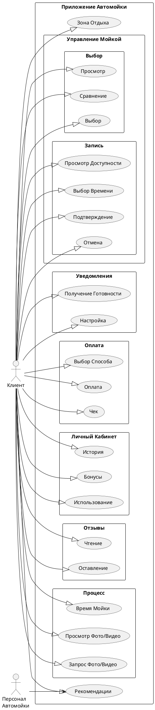

# car-wash
# Блок USER STORY
1. Выбор типа мойки:

•  Как клиент автомойки, я хочу иметь возможность выбрать тип мойки (ручную, автоматическую или экспресс), чтобы обслуживать мой автомобиль в соответствии с моими предпочтениями и доступным временем.

•  Как клиент, я хочу видеть подробное описание каждого типа мойки (ручной, автоматической, экспресс), чтобы сделать информированный выбор.

2. Запись на мойку онлайн:

•  Как клиент, я хочу записываться на мойку через мобильное приложение или сайт, чтобы выбрать удобное для меня время и избежать очереди.

•  Как клиент, я хочу видеть доступные временные слоты для записи на мойку в режиме реального времени, чтобы выбрать наиболее удобное время.

•  Как клиент, я хочу иметь возможность отменить или перенести мою запись на мойку онлайн, в случае изменения моих планов.

3. Уведомление о готовности автомобиля:

•  Как клиент, я хочу получать уведомление (через приложение/SMS) о готовности моего автомобиля после мойки, чтобы точно знать, когда его можно забрать.

•  Как клиент, я хочу иметь возможность выбрать способ уведомления о готовности автомобиля (SMS, push-уведомление в приложении).

4. Оплата услуг онлайн:

•  Как клиент, я хочу иметь возможность оплатить услуги автомойки онлайн через приложение или сайт, чтобы избежать очередей и не тратить время на оплату на месте.

•  Как клиент, я хочу иметь возможность выбирать удобный способ оплаты онлайн (банковская карта, электронный кошелек и т.д.).

•  Как клиент, я хочу получить электронный чек или подтверждение оплаты после успешной онлайн-транзакции.

5. Скидки/бонусы:

•  Как постоянный клиент, я хочу получать скидки или бонусы за постоянное использование услуг автомойки, чтобы экономить на дальнейших визитах.

•  Как клиент, я хочу видеть информацию о накопленных бонусах/скидках в моем личном кабинете в приложении/на сайте.

•  Как клиент, я хочу иметь возможность использовать накопленные бонусы/скидки при оплате услуг автомойки.

6. Отзывы клиентов:

•  Как клиент, я хочу иметь возможность читать отзывы других клиентов о качестве работы автомойки, чтобы быть уверенным в высоком уровне обслуживания.

•  Как клиент, я хочу иметь возможность оставлять свои отзывы и оценки о работе автомойки.

•  Как клиент, я хочу видеть рейтинги автомойки на основе отзывов других клиентов.

7. Мойка в оговоренное время:

•  Как клиент, я хочу, чтобы мой автомобиль был помыт в течение оговоренного времени, чтобы не тратить лишнее время.

•  Как клиент, я хочу получать информацию о предполагаемом времени мойки перед записью.

8. Зона отдыха:

•  Как клиент, я хочу, чтобы на автомойке была зона.

•  Как современный человек, я хочу иметь доступ к интернету во время ожидания своего автомобиля.

# USE CASES

