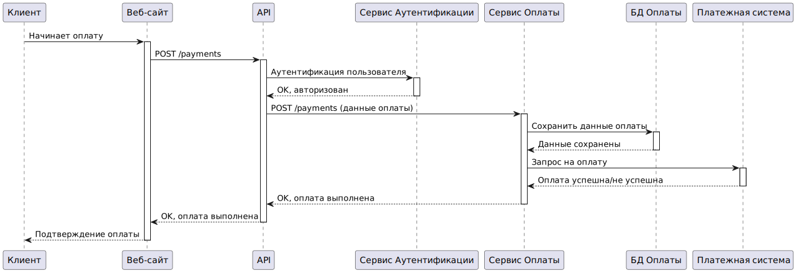

# car-wash
# Блок USER STORY
1. Выбор типа мойки:

•  Как клиент автомойки, я хочу иметь возможность выбрать тип мойки (ручную, автоматическую или экспресс), чтобы обслуживать мой автомобиль в соответствии с моими предпочтениями и доступным временем.

•  Как клиент, я хочу видеть подробное описание каждого типа мойки (ручной, автоматической, экспресс), чтобы сделать информированный выбор.

2. Запись на мойку онлайн:

•  Как клиент, я хочу записываться на мойку через мобильное приложение или сайт, чтобы выбрать удобное для меня время и избежать очереди.

•  Как клиент, я хочу видеть доступные временные слоты для записи на мойку в режиме реального времени, чтобы выбрать наиболее удобное время.

•  Как клиент, я хочу иметь возможность отменить или перенести мою запись на мойку онлайн, в случае изменения моих планов.

3. Уведомление о готовности автомобиля:

•  Как клиент, я хочу получать уведомление (через приложение/SMS) о готовности моего автомобиля после мойки, чтобы точно знать, когда его можно забрать.

•  Как клиент, я хочу иметь возможность выбрать способ уведомления о готовности автомобиля (SMS, push-уведомление в приложении).

4. Оплата услуг онлайн:

•  Как клиент, я хочу иметь возможность оплатить услуги автомойки онлайн через приложение или сайт, чтобы избежать очередей и не тратить время на оплату на месте.

•  Как клиент, я хочу иметь возможность выбирать удобный способ оплаты онлайн (банковская карта, электронный кошелек и т.д.).

•  Как клиент, я хочу получить электронный чек или подтверждение оплаты после успешной онлайн-транзакции.

5. Скидки/бонусы:

•  Как постоянный клиент, я хочу получать скидки или бонусы за постоянное использование услуг автомойки, чтобы экономить на дальнейших визитах.

•  Как клиент, я хочу видеть информацию о накопленных бонусах/скидках в моем личном кабинете в приложении/на сайте.

•  Как клиент, я хочу иметь возможность использовать накопленные бонусы/скидки при оплате услуг автомойки.

6. Отзывы клиентов:

•  Как клиент, я хочу иметь возможность читать отзывы других клиентов о качестве работы автомойки, чтобы быть уверенным в высоком уровне обслуживания.

•  Как клиент, я хочу иметь возможность оставлять свои отзывы и оценки о работе автомойки.

•  Как клиент, я хочу видеть рейтинги автомойки на основе отзывов других клиентов.

7. Мойка в оговоренное время:

•  Как клиент, я хочу, чтобы мой автомобиль был помыт в течение оговоренного времени, чтобы не тратить лишнее время.

•  Как клиент, я хочу получать информацию о предполагаемом времени мойки перед записью.

8. Зона отдыха:

•  Как клиент, я хочу, чтобы на автомойке была зона.

•  Как современный человек, я хочу иметь доступ к интернету во время ожидания своего автомобиля.

# USE CASES

## Диаграмма "Автомойка"

    
Код диаграммы "Автомойка"

    <pre><code class="language-plantuml">
@startuml
left to right direction
skinparam packageStyle rectangle

actor Client as "Клиент"
actor "Персонал\nАвтомойки" as Staff

rectangle "Приложение Автомойки" {
    package "Управление Мойкой" as Wash {
        package "Выбор" {
            usecase "Просмотр" as UC1_1
            usecase "Сравнение" as UC1_2
            usecase "Выбор" as UC1_3
        }
        package "Запись" {
            usecase "Просмотр Доступности" as UC2_1
            usecase "Выбор Времени" as UC2_2
            usecase "Подтверждение" as UC2_3
            usecase "Отмена" as UC2_4
        }
    }

     package "Уведомления" {
          usecase "Получение Готовности" as UC3_1
          usecase "Настройка" as UC3_2
    }
    package "Оплата" {
          usecase "Выбор Способа" as UC4_1
        usecase "Оплата" as UC4_2
        usecase "Чек" as UC4_3
     }

    package "Личный Кабинет" as LK{
        usecase "История" as UC5_1
        usecase "Бонусы" as UC5_2
        usecase "Использование" as UC5_3
    }

   package "Отзывы" {
         usecase "Чтение" as UC6_1
       usecase "Оставление" as UC6_2
   }

   package "Процесс" {
      usecase "Время Мойки" as UC7_1
      usecase "Просмотр Фото/Видео" as UC8_1
        usecase "Запрос Фото/Видео" as UC8_2
    }

 usecase "Рекомендации" as UC9
 usecase "Зона Отдыха" as UC10

}

Client --|> UC1_1
Client --|> UC1_2
Client --|> UC1_3

Client --|> UC2_1
Client --|> UC2_2
Client --|> UC2_3
Client --|> UC2_4

Client --|> UC3_1
Client --|> UC3_2

Client --|> UC4_1
Client --|> UC4_2
Client --|> UC4_3

Client --|> UC5_1
Client --|> UC5_2
Client --|> UC5_3

Client --|> UC6_1
Client --|> UC6_2

Client --|> UC7_1
Client --|> UC8_1
Client --|> UC8_2

Client --|> UC9
Client --|> UC10

Staff --> UC9

@enduml
</code></pre>

# Сценарии использования:

1. Новая регистрация и знакомство с приложением:

•   Сценарий 1.1: Пользователь впервые устанавливает приложение.

    Базовый сценарий:
    
        1.  Пользователь загружает и открывает приложение.
        
        2.  Приложение предлагает регистрацию.
        
        3.  Пользователь вводит email, телефон, или выбирает быструю регистрацию через соцсеть.
        
        4.  Пользователь подтверждает email/телефон, вводит код.
        
        5.  Пользователь задает пароль.
        
        6.  Приложение приветствует и показывает краткое обучение.
        
        7.  Пользователь попадает на главный экран.
        
    Альтернативный сценарий:
    
        1.  Пользователь пытается зарегистрироваться, используя уже зарегистрированный email/номер телефона.
        
        2.  Приложение сообщает о существующей учетной записи и предлагает войти или восстановить пароль.
        
        3.  Пользователь выбирает вход, вводит свои данные и успешно входит в приложение.

•   Сценарий 1.2: Пользователь уже имеет аккаунт, но впервые использует приложение на новом устройстве.

    Базовый сценарий:
   
        1.  Пользователь открывает приложение на новом устройстве.
        
        2.  Приложение предлагает войти.
        
        3.  Пользователь вводит логин/пароль и успешно входит.
        
        4.  Приложение открывает главный экран с настроенными данными пользователя.
        
    Альтернативный сценарий:
   
        1.  Пользователь вводит неверные логин или пароль.
        
        2.  Приложение сообщает об ошибке ввода и предлагает повторить попытку или восстановить пароль.
        
        3.  Пользователь сбрасывает пароль или повторяет ввод и входит в приложение.

•   Сценарий 1.3: Пользователь забыл пароль.

    Базовый сценарий:
    
        1.  Пользователь нажимает "Забыли пароль" на экране входа.
        
        2.  Приложение предлагает восстановление по email или телефону.
        
        3.  Пользователь выбирает способ, вводит email/телефон.
        
        4.  Приложение отправляет проверочный код.
        
        5.  Пользователь вводит код и создает новый пароль.
        
        6.  Пользователь входит с новым паролем.
        
    Альтернативный сценарий:
    
        1.  Пользователь запрашивает восстановление, но не имеет доступа к email/телефону.
        
        2.  Приложение сообщает, что не удалось подтвердить данные.
        
        3.  Пользователю предлагается обратиться в службу поддержки для восстановления доступа.

2. Запись на мойку:

•   Сценарий 2.1: Пользователь выбирает ручную мойку и записывается на нее.

    Базовый сценарий:
    
        1.  Пользователь выбирает "Записаться".
        
        2.  Выбирает "ручная мойка".
        
        3.  Приложение показывает доступные слоты.
        
        4.  Пользователь выбирает время.
        
        5.  Приложение показывает подтверждение и предлагает добавить в календарь.
        
        6.  Пользователь получает push-уведомление.
        
    Альтернативный сценарий:
    
        1.  Пользователь записывается, но во время записи пропадает соединение с интернетом.
        
        2.  Приложение сохраняет запись локально и пытается ее отправить после восстановления соединения.
        
        3.  Приложение отправляет push-уведомление об успешной записи.

•   Сценарий 2.2: Пользователь пытается записаться на полностью занятое время.

    Базовый сценарий:
    
        1.  Пользователь выбирает тип и дату мойки.
        
        2.  Приложение сообщает об отсутствии свободных слотов.
        
        3.  Пользователь выбирает другую дату и успешно записывается.
        
    Альтернативный сценарий:
    
        1.  Пользователь пытается записаться на полностью занятое время, не выбирая другую дату.
        
        2.  Приложение предлагает поставить в лист ожидания на случай отмены.
        
        3.  Пользователь соглашается и получает уведомление при освобождении места.        

•   Сценарий 2.3: Пользователь отменяет запись.

    Базовый сценарий:
    
        1.  Пользователь открывает "Мои записи".
        
        2.  Выбирает запись и нажимает "Отменить".
        
        3.  Приложение показывает запрос подтверждения отмены.
        
        4.  Пользователь подтверждает.
        
        5.  Приложение отменяет запись и отправляет уведомление.
        
    Альтернативный сценарий:
    
        1.  Пользователь пытается отменить запись менее чем за 2 часа до начала.
        
        2.  Приложение сообщает, что отмена невозможна, либо будет применена штрафная санкция.
        
        3.  Пользователь либо соглашается, либо оставляет запись.

3. Оплата услуг:

•   Сценарий 3.1: Пользователь оплачивает услугу онлайн.

    Базовый сценарий:
    
        1.  Пользователь выбирает "Оплатить".
        
        2.  Выбирает "Карта" как способ оплаты.
        
        3.  Приложение запрашивает данные карты.
        
        4.  Пользователь вводит данные и оплачивает.
        
        5.  Приложение подтверждает оплату и отправляет электронный чек.
        
    Альтернативный сценарий:
    
        1.  Во время оплаты происходит ошибка с банком.
        
        2.  Приложение сообщает об ошибке и предлагает попробовать еще раз, либо использовать другой способ.
        
        3.  Пользователь пробует снова или выбирает другой метод.

•   Сценарий 3.2: Пользователь имеет бонусы/скидки и хочет их использовать.

    Базовый сценарий:
    
        1.  Пользователь выбирает способ оплаты.
        
        2.  Приложение показывает бонусы/скидки и предлагает их применить.
        
        3.  Пользователь соглашается и оплачивает уменьшенную сумму.
        
        4.  Приложение подтверждает оплату.
        
    Альтернативный сценарий:
    
        1.  У пользователя есть бонусы, но они не применяются по причине не соответствия условиям акции.
        
        2.  Приложение уведомляет об этом и предлагает оплатить полную сумму.
        
        3.  Пользователь оплачивает полную стоимость или отказывается от оплаты.

4. Уведомления и информация:

•   Сценарий 4.1: Пользователь получает уведомление о готовности автомобиля.

    Базовый сценарий:
    
        1.  Автомойщик заканчивает мойку.
        
        2.  Приложение отправляет пользователю push-уведомление о готовности.
        
        3.  Пользователь получает уведомление и забирает машину.
        
    Альтернативный сценарий:
    
        1.  Пользователь отключает уведомления в настройках приложения.
        
        2.  Приложение не отправляет push-уведомление.
        
        3.  Пользователь должен отслеживать статус заказа вручную в приложении.

•   Сценарий 4.2: Пользователь просматривает рекомендации по уходу за автомобилем.

    Базовый сценарий:
    
        1.  Пользователь заходит в раздел "Рекомендации".
        
        2.  Приложение отображает список рекомендаций.
        
        3.  Пользователь просматривает.
        
    Альтернативный сценарий:
    
        1.  Пользователь открывает раздел "Рекомендации" при отсутствии соединения с интернетом.
        
        2.  Приложение отображает ранее загруженные рекомендации, а новые загружаются позже.

5. Отзывы и рейтинг:

•   Сценарий 5.1: Пользователь оставляет отзыв о работе автомойки.

    Базовый сценарий:
    
        1.  Пользователь открывает "Мои заказы".
        
        2.  Выбирает заказ и нажимает "Оставить отзыв".
        
        3.  Оценивает качество и пишет комментарий.
        
        4.  Отправляет отзыв.
        
    Альтернативный сценарий:
    
        1.  Пользователь пытается оставить отзыв без оценки, или с пустым комментарием.
        
        2.  Приложение сообщает об ошибке и предлагает заполнить все обязательные поля.
        
        3.  Пользователь вносит необходимые данные и оставляет отзыв.

•   Сценарий 5.2: Пользователь просматривает отзывы других клиентов.

    Базовый сценарий:

        1.  Пользователь открывает раздел "Отзывы".
        
        2.  Приложение показывает отзывы и рейтинги.
        
        3.  Пользователь просматривает отзывы.
        
    Альтернативный сценарий:
    
        1.  Пользователь заходит в раздел "Отзывы", но там нет ни одного отзыва.
        
        2.  Приложение показывает сообщение о том, что пока нет отзывов.

6. Дополнительные возможности:

•   Сценарий 6.1: Пользователь просматривает фото/видео процесса мойки.

    Базовый сценарий:
    
        1.  Пользователь открывает "Мои заказы", выбирает заказ.
        
        2.  Приложение отображает фото/видео (если есть).
        
    Альтернативный сценарий:
    
        1.  Пользователь открывает заказ, но фото/видео не загружаются.
        
        2.  Приложение сообщает о проблеме с загрузкой и предлагает попробовать позже.

•   Сценарий 6.2: Пользователь использует зону ожидания.

    Базовый сценарий:
    
        1.  Пользователь приезжает на автомойку.
        
        2.  Использует зону ожидания, пользуется Wi-Fi и напитками.
        
    Альтернативный сценарий:
    
         1.  Пользователь приезжает на автомойку, но Wi-Fi не работает или нет доступных напитков.
         
         2.  Пользователь использует альтернативные варианты развлечения и отдыха.

# ER диаграмма

    
Код диаграммы "Автомойка"

    <pre><code class="language-plantuml">
@startuml
' Определяем сущности (entities)
entity Пользователь {
  • id : INTEGER (PK)
  --
  email : VARCHAR
  телефон : VARCHAR
  пароль : VARCHAR
  имя : VARCHAR
  фамилия : VARCHAR
  дата_регистрации : DATETIME
  ' дополнительные атрибуты
}

entity Мойка {
    * id : INTEGER (PK)
    --
    тип : VARCHAR
    цена : DECIMAL
    время_мойки : INTEGER
    описание : TEXT
    'дополнительные атрибуты
}

entity Запись {
    * id : INTEGER (PK)
    --
    пользователь_id : INTEGER (FK)
    мойка_id : INTEGER (FK)
    дата_время : DATETIME
    статус : VARCHAR
    общая_стоимость : DECIMAL
    'дополнительные атрибуты
}

entity Оплата {
    * id : INTEGER (PK)
    --
    запись_id : INTEGER (FK)
    способ_оплаты : VARCHAR
    дата_оплаты : DATETIME
    сумма_оплаты : DECIMAL
    чек_номер : VARCHAR
    'дополнительные атрибуты
}

entity Отзыв {
  • id : INTEGER (PK)
  --
  пользователь_id : INTEGER (FK)
  запись_id : INTEGER (FK)
  рейтинг : INTEGER
  комментарий : TEXT
  дата_отзыва : DATETIME
  'дополнительные атрибуты
}

entity Бонусы_Скидки {
  • id : INTEGER (PK)
  --
  пользователь_id : INTEGER (FK)
  тип : VARCHAR
  сумма : DECIMAL
  дата_активации : DATETIME
  дата_истечения : DATETIME
  'дополнительные атрибуты
}

entity Рекомендации {
  • id : INTEGER (PK)
  --
  текст : TEXT
  дата_публикации : DATETIME
    'дополнительные атрибуты
}
'Определяем связи между сущностями

Пользователь ||--o{ Запись : "делает"
Запись  ||--o{ Мойка : "содержит"
Запись  ||--o{ Оплата : "включает"
Пользователь  ||--o{ Отзыв : "оставляет"
Запись ||--o{ Отзыв : "относится к"
Пользователь  ||--o{ Бонусы_Скидки : "имеет"

'Связь Many-to-Many между Мойка и Рекомендации
'entity Мойка_Рекомендации{
'  * мойка_id: INTEGER (FK)
'   * рекомендации_id : INTEGER (FK)
'}
'Мойка ||--o{  Мойка_Рекомендации : "соответствует"
'Рекомендации ||--o{  Мойка_Рекомендации : "соответствует"

Мойка ||--o{  Рекомендации : "имеет"

@enduml
</code></pre>

Сущности:

•  Пользователь: Представляет пользователя приложения с его данными (id, email, телефон, пароль, имя, фамилия, дата регистрации).

•  Мойка: Представляет тип мойки с характеристиками (id, тип, цена, время мойки, описание).

•  Запись: Представляет запись пользователя на мойку (id, пользователь_id, мойка_id, дата/время, статус).

•  Оплата: Представляет информацию об оплате (id, запись_id, способ оплаты, дата оплаты, сумма оплаты, чек).

•  Отзыв: Представляет отзывы пользователей (id, пользователь_id, запись_id, рейтинг, комментарий, дата отзыва).

• Бонусы\_Скидки: Представляет информацию о бонусах и скидках пользователя (id, пользователь\_id, тип, сумма, дата активации, дата истечения).

•  Рекомендации: Представляет рекомендации по уходу за автомобилем (id, текст, дата публикации).

•  Мойка\_Рекомендации (закомментированно) : Связь многие-ко-многим для связи мойки с рекомендацией (закомментировано).

Связи:

•  Пользователь делает Запись (один ко многим).

•  Запись содержит Мойку (один к одному).

•  Запись включает Оплату (один к одному).

•  Пользователь оставляет Отзыв (один ко многим).

•  Запись относится к Отзыву (один ко многим).

•  Пользователь имеет Бонусы_Скидки (один ко многим).

•  Мойка имеет Рекомендации (один ко многим).

# С4 model

## C1
 
## C2
 

# Sequense Diagram

## Запись пользователя на мойку через мобильное приложение

    
Код диаграммы

    <pre><code class="language-plantuml">

@startuml
participant "Клиент" as User
participant "Мобильное приложение" as MobileApp
participant "API Gateway" as APIGateway
participant "Сервис Аутентификации" as AuthService
participant "Сервис Записи" as BookingService
database "БД Записей" as BookingDB
participant "Сервис Уведомлений" as NotificationService

User -> MobileApp : Выбирает тип мойки и время
activate MobileApp
MobileApp -> APIGateway : POST /bookings
activate APIGateway
APIGateway -> AuthService : Аутентификация пользователя
activate AuthService
AuthService --> APIGateway : OK, авторизован
deactivate AuthService
APIGateway -> BookingService : POST /bookings (данные записи)
activate BookingService
BookingService -> BookingDB : Сохранить данные записи
activate BookingDB
BookingDB --> BookingService : Запись сохранена
deactivate BookingDB
BookingService --> APIGateway : OK, запись создана
deactivate BookingService
APIGateway --> MobileApp : OK, запись создана
deactivate APIGateway
MobileApp -> NotificationService : Уведомление о записи
activate NotificationService
NotificationService --> MobileApp : Уведомление отправлено
deactivate NotificationService
MobileApp --> User : Показывает подтверждение
deactivate MobileApp
@enduml

</code></pre>

## Оплата пользователем через веб-сайт

    
Код диаграммы

    <pre><code class="language-plantuml">
@startuml
participant "Клиент" as User
participant "Веб-сайт" as WebApp
participant "API Gateway" as APIGateway
participant "Сервис Аутентификации" as AuthService
participant "Сервис Оплаты" as PaymentService
database "БД Оплаты" as PaymentDB
participant "Платежная система" as PaymentSystem

User -> WebApp : Начинает оплату
activate WebApp
WebApp -> APIGateway : POST /payments
activate APIGateway
APIGateway -> AuthService : Аутентификация пользователя
activate AuthService
AuthService --> APIGateway : OK, авторизован
deactivate AuthService
APIGateway -> PaymentService : POST /payments (данные оплаты)
activate PaymentService
PaymentService -> PaymentDB : Сохранить данные оплаты
activate PaymentDB
PaymentDB --> PaymentService : Данные сохранены
deactivate PaymentDB
PaymentService -> PaymentSystem : Запрос на оплату
activate PaymentSystem
PaymentSystem --> PaymentService : Оплата успешна/не успешна
deactivate PaymentSystem
PaymentService --> APIGateway : OK, оплата выполнена
deactivate PaymentService
APIGateway --> WebApp : OK, оплата выполнена
deactivate APIGateway
WebApp --> User : Подтверждение оплаты
deactivate WebApp
@enduml

</code></pre>

## Получение отзыва от пользователя

Код диаграммы

    <pre><code class="language-plantuml">
@startuml
participant "Клиент" as User
participant "Мобильное приложение" as MobileApp
participant "API Gateway" as APIGateway
participant "Сервис Аутентификации" as AuthService
participant "Сервис Интеграции с Поддержкой" as SupportIntegrationService
participant "Система Поддержки" as SupportSystem

User -> MobileApp : Отправляет запрос в поддержку
activate MobileApp
MobileApp -> APIGateway : POST /support
activate APIGateway
APIGateway -> AuthService : Аутентификация пользователя
activate AuthService
AuthService --> APIGateway : OK, авторизован
deactivate AuthService
APIGateway -> SupportIntegrationService : POST /support (данные запроса)
activate SupportIntegrationService
SupportIntegrationService -> SupportSystem : Отправить запрос в систему поддержки
activate SupportSystem
SupportSystem --> SupportIntegrationService : Запрос сохранен
deactivate SupportSystem
SupportIntegrationService --> APIGateway : OK, запрос сохранен
deactivate SupportIntegrationService
APIGateway --> MobileApp : OK, запрос отправлен
deactivate APIGateway
MobileApp --> User : Подтверждение отправки запроса
deactivate MobileApp
@enduml

</code></pre>

# Спецификация OpenAPI

